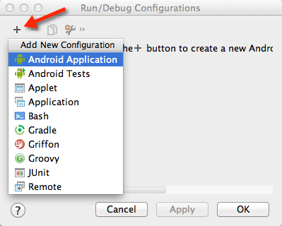
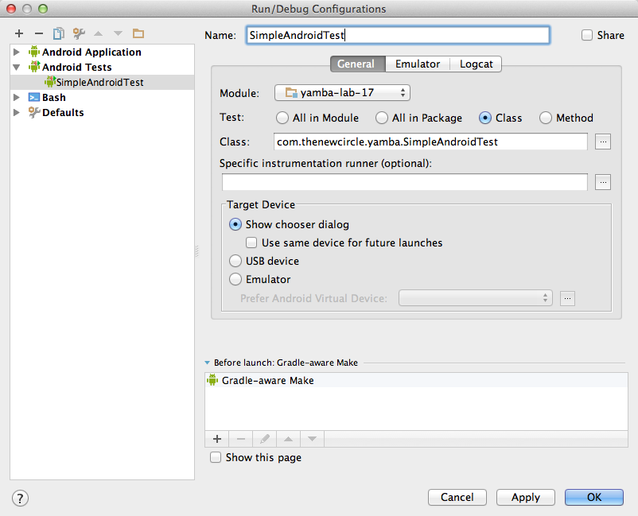
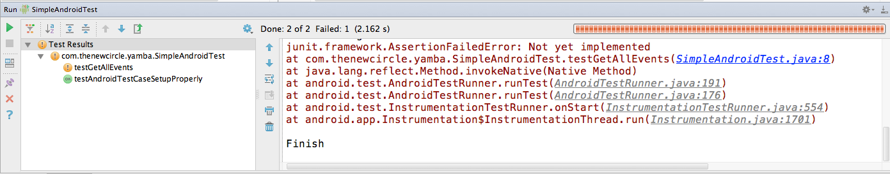
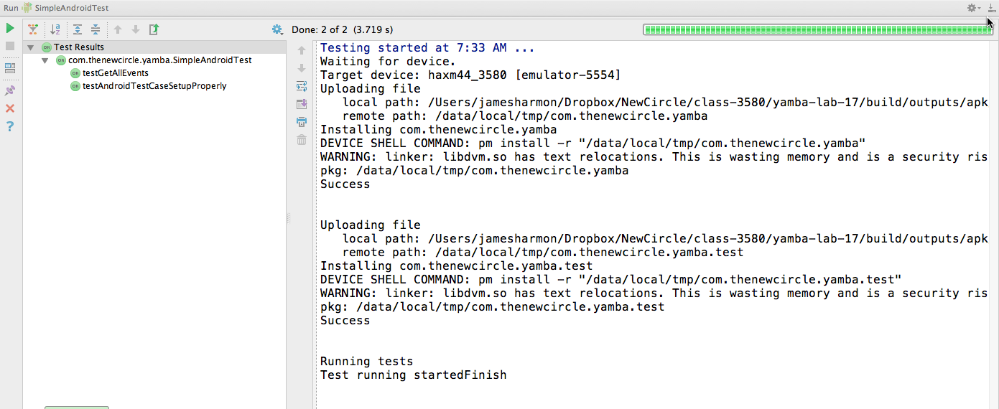

**Lab 3.1 – Unit Testing an Android App with Android Studio **

**Overview: **

In this lab you will create some unit tests for your AndroidLab project.
Android uses the jUnit 3 framework for unit testing.

**Setup:**

Android Studio should already be installed. The SDK should be updated with the
latest version of Android.

**Steps**

  1) Create the directory to contain unit tests.

  1.a) Inside the module you want to test, navigate to the "src" directory.

  1.b) Create a new directory called "androidTest".  This will be at the same level as the "main" directory.

  1.c) Inside the "androidTest" directory create a directory called "java".  This is where the unit test code will be placed.

  1.d) Inside "java" create a package with the same value as in your "main/java" directory.  Use the package wizard.

Create a package named "com.thenewcircle.yamba".

Note: Using the same package name is not required but ensures that the test classes
have the save "visibility" as the classes under test.

  2) Add configuration information to the +build.gradle+ file.

  2.a) Modify the gradle build file.

[source,title="build.gradle"]
----
android {
  defaultConfig {
    ...
    testPackageName "com.thenewcircle.yamba.test"
    testInstrumentationRunner "android.test.InstrumentationTestRunner"
    testFunctionalTest true
  }
  ...
}
----

Note: The +testPackageName+ must not be the same as the package name since this
is the unique identifier for the test apk.  Android does testing by generating
a separate apk from the app under test.

  3) Create a unit test.  Unit tests will be placed in the java package under the "androidTest" directory.

Unit tests are created as java code.

  3.a) In +src/androidTest/java/com.thenewcircle.yamba+ create a java class named "SimpleAndroidTest"

Select "New -> Java Class".  There is no specific wizard for unit tests.

  3.b)  Extend the +AndroidTestCase+ class

[source]
----
public class SimpleAndroidTest extends AndroidTestCase {
}
----

  3.c)  And a method call "testGetAllEvents"

[source]
----
public void testGetAllEvents() {
		fail("Not yet implemented");
}
----

This follows the "fail first" strategy of unit testing

  4) Run the unit test and verify that it fails.  You must create a run configuration to run the test.

  4.a) Select "Run -> Edit Configurations" from the top level menu.

  4.b) Select "+" to add a new run configuration and select "Android Tests"

.Add Android Test

  4.c) Define the test by entering the following values in the wizard:

[cols="2*", width=50%]
|===

|Name 
|SimpleAndroidTest

|Module
|yamba-lab-17

|Test
|Class

|Class
|com.thenewcircle.yamba.SimpleAndroidTest

|Specific instrumentation runner
|blank

|Target Device
|Show chooser dialog

|===

The wizard should look like this:

.Android Test Wizard

  4.d) Run "SimpleAndroidTest" using the play button.

Under the "Run" tab at the bottom of the screen you should see the jRunner output:

.Runner Output

Note: The test failed because you forced it to.

  5) Create a working test

  5.a) Select "Run -> Edit Configurations" from the top level menu.

[source]
----
public void testGetAllEvents() {

        YambaClient yambaClient = new YambaClient("student","password");

        try {
            List<YambaClient.Status> timeline = yambaClient.getTimeline(100);
            assertTrue(timeline.size() > 0);
        } catch (YambaClientException e) {
            e.printStackTrace();
            fail("Yamba call failed");
        }

}
----

  5.b) Run "SimpleAndroidTest" again using the play button.

Under the "Run" tab at the bottom of the screen you should see the jRunner output:

.Runner Output

Note: This time you should see a green bar to signify that the test worked (Green is clean!!!, Read id dead!!!)

  6.)	Create a unit test for activity UI.  Although you’ve tested the event service directly, as you should also verify that the UI view element that the user sees contains the correct value.  Create a unit test to run the actual activity and inspect the UI element.

  6.a)  Create a new jUnit Test Case for the MainActivity called “MainActivityTest”.  Extend the activity testing class from:

[source]
----
android.test.ActivityInstrumentationTestCase2<MainActivity>
----

  6.b)  Create a new constructor

[source]
----
 public MainActivityTest() {
   super("com.garagze", MainActivity.class);
 }
----

  6.c)  Create setup method and an instance variable for the activity.

[source]
----
MainActivity mainActivity;

@Override
protected void setUp() throws Exception {
   super.setUp();
   mainActivity = getActivity();
}
----

  6.d)  Create a new test method called “testActivityUI” which will lookup the text element and check it’s value.

[source,title="textActivityUI method"]
----
public void testActivityUI() {
   TextView textView = (TextView) mainActivity.findViewById(com.garagze.R.id.textView);
   assertEquals("Number of events: 15", textView.getText().toString());
}
----

  6.e)  Create a new run configuration and un the test until you get a green bar.

  7.)	Code a test application that interacts with a View of the application under test must run in the main application's thread, also known as the UI thread.  The Android testing framework provides an annotation for ensuring that code runs on the main UI thread.  Create the following test method to verify that you can change the value of a UI view:

  7.a) Create a new method called +testView+ and test the value of a view element.

Use the following only as a template - your code will probably be different.

[source]
----
  @UiThreadTest
  public void testView() {
  	  TextView textView = (TextView) mainActivity.findViewById(R.id.textView);
    textView.setText("abc");
    assertEquals("abc", textView.getText().toString());
  	}
----

  7.b)  Run the test until you get a green bar.

LAB  3.1

© Copyright, Object Training Group, Inc.

