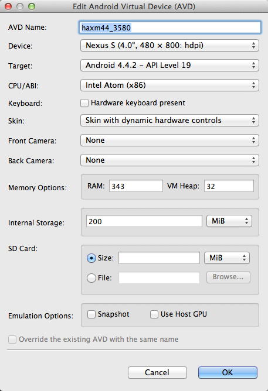
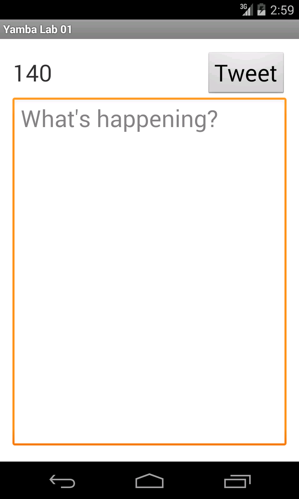

**Lab 1.0 – Status Activity Layout**

**Overview: **

In this lab you will build a simple UI.

**Setup:**

Android Studio should be installed.

**Steps**

  1) Create a new Android Project in Android Studio

  1.a) From the Android Studio Welcome screen select "New Project"

Enter the following values in the "New Project" wizard:

[cols="2"]
|===

|Application Name
|Yamba

|Module Name
|yamba

|Package Name
|com.thenewcircle.yamba

|Project Location
|<your directory>/YambaProject

|Minimum Required SDK
|API 15

|Target SDK
|API 19

|Compile With
|API 19

|Language Level
|7.0

|Theme
|Halo Light With Dark Action Bar

|Create custom launcher icon
|unchecked

|Create activity
|checked

|Mark this project as library
|unchecked

|===

Click "Next"

  1.b) Complete the 2nd screen of the New Project wizard.

Select "Empty Activity"

Click "Next"

  1.c) Complete the 3rd screen of the New Project wizard.

Enter the following:

[cols="2*"]
|===

|Activity Name
|StatusActivity

|Layout Name
|activity_status

|===

Click "Finish"

 2) Modify the default layout

The modified screen will have three components:

- A big text area to type our 140-character status update. We’ll use an EditText
 widget for this purpose.

- A button to click to update the status. This will be a Button  widget.

- A layout to contain all these widgets and lay them out one after another in a vertical
fashion. For this screen, we’ll use LinearLayout , one of the more common ones.

  2.a) Modify the +res/layout/activity_status.xml+ file.
  
You can modify the XML layout file using the layout editor or by modifying the XML
directly as shown below:

[source, title=res/layout.status.xml]
----
<?xml version="1.0" encoding="utf-8"?>

<!-- Main Layout of Status Activity -->
<LinearLayout
    xmlns:android="http://schemas.android.com/apk/res/android"
    android:orientation="vertical"
    android:layout_width="fill_parent"
    android:layout_height="fill_parent">

    <!-- Title TextView-->
    <TextView
        android:layout_width="fill_parent"
        android:layout_height="wrap_content"
        android:gravity="center"
        android:textSize="30sp"
        android:layout_margin="10dp"
        android:text="@string/titleStatus"/>

    <!-- Status EditText -->
    <EditText
        android:layout_width="fill_parent"
        android:layout_height="fill_parent"
        android:layout_weight="1"
        android:hint="@string/hintText"
        android:id="@+id/editText"
        android:gravity="top|center_horizontal">
    </EditText>

    <!-- Update Button -->
    <Button
        android:layout_width="fill_parent"
        android:layout_height="wrap_content"
        android:text="@string/buttonUpdate"
        android:textSize="20sp"
        android:id="@+id/buttonUpdate">
    </Button>

</LinearLayout>
----

  2.b) The text values in the layout should be externalized as string resources. Include them in the +strings.xml+ file

[source, title=res/values/strings.xml]
----
<?xml version="1.0" encoding="utf-8"?>
<resources>
    <string name="app_name">Yamba 1</string>
    <string name="titleYamba">Yamba</string>
    <string name="titleStatus">Status Update</string>
    <string name="hintText">Please enter your 140-character status</string>
    <string name="buttonUpdate">Update</string>
</resources>
----

  3.) Configure an emulator and start it

Tools -> Android -> AVD Manager

Click “New”

Following are the suggested configuration options for creating your
virtual device:

[cols="2*", width=50%]
|===

|AVD Name 
|android44

|Device 
|Nexus 4

|Target 
|Android 4.4

|CPU/ABI
|blank

|Keyboard 
|checked

|Skin 
|checked

|Front Camera 
|None

|Back Camera 
|None

|Memory Options 
|Ram: 1024, VM Heap: 32

|Internal Storage 
|200 MiB

|SD Card
|blank

|Emulation Options
|blank

|===

.Edit Android Virtual Device

Click "OK"

Select "android44"

Click “Start”

On "Launch Options" leave defaults

Click "Launch"

Note:  In Windows the emulator may take 3 to 5 minutes to fully start. 
Wait for the home page on the emulator to appear to confirm that it has started.

 4) Run the app.  The screen output should be similar to the following image:

.Status Activity Screen 

