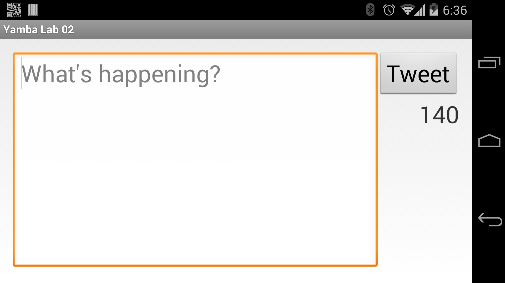
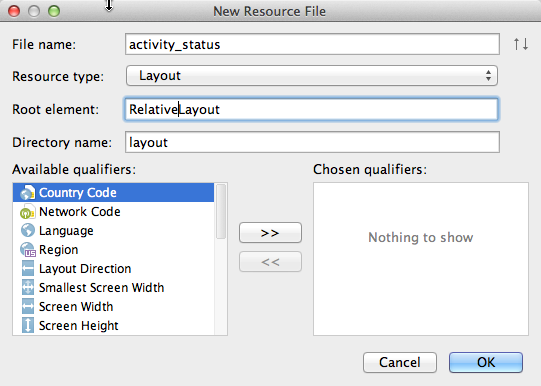

**Lab 2.0 – Status Activity Landscape Layout **

**Overview: **

In this lab you will create a layout to be used when the device is in landscape mode.

**Setup:**

Lab 01 must be complete.

**Steps**

  1) Create a landscape layout. This can be done manually by using the "Create Directory" and
  "Create File" primitives in AS or by using the wizard.

  a. Create a new folder in "res" named "layout-land"

  b. Create a layout file in "res/layout-land" with the same name as the layout in "res/layout".
This should be "activity_status.xml"

Modify the layout so that the "Tweet" button appears to the right of the text entry box
and the character count appears below the "Tweet" button which the device is in landscape mode.

For example, try to make the layout look like this:

.Status Activity in Landscape Mode

Or be creative and change the layout in some other way.

The following code can be used for the landscape layout.  This code was generated by AS.

[source, title="res/layout/activity_status.xml"]
----
<RelativeLayout xmlns:android="http://schemas.android.com/apk/res/android"
    xmlns:tools="http://schemas.android.com/tools"
    android:layout_width="match_parent"
    android:layout_height="match_parent" >

    <Button
        android:id="@+id/status_button_tweet"
        style="@style/font_general"
        android:layout_width="wrap_content"
        android:layout_height="wrap_content"
        android:layout_alignParentRight="true"
        android:layout_alignParentTop="true"
        android:text="@string/status_button_tweet" />

    <EditText
        android:id="@+id/status_text"
        style="@style/font_general"
        android:layout_width="match_parent"
        android:layout_height="match_parent"
        android:layout_alignTop="@+id/status_button_tweet"
        android:layout_toLeftOf="@+id/status_button_tweet"
        android:ems="10"
        android:gravity="top|left"
        android:hint="@string/status_text_hint"
        android:inputType="textMultiLine" >

        <requestFocus />
    </EditText>

    <TextView
        android:id="@+id/status_text_count"
        style="@style/font_general"
        android:layout_width="wrap_content"
        android:layout_height="wrap_content"
        android:layout_alignRight="@+id/status_button_tweet"
        android:layout_below="@+id/status_button_tweet"
        android:text="140" />

</RelativeLayout>
----

  c. Try creating the directory and layout file using the wizard.

Right click on the +src/main/res+ directory and select the following options:

New -> Android resource file

Enter the following in the "New Resource File" wizard:

[cols="2*", width=50]
|===

|File Name
|activity_status

|Resource Type
|Layout

|Root Element
|RelativeLayout

|Directory Name
|layout

|Available Qualifiers
|Orientation

|Orientation
|Landscape

|===

.New Resource File Wizard

  Note: Notice that the wizard creates both the directory and the file.

 3)  Run the application and put the device in landscape mode.

If you are running on a real device simple rotate the device.

If you are running on an emulator, you will need to use the following key sequence to toggle orientation:

  On windows use: <ctrl><F12>

  On the Mac use: <ctrl><fn><F12>

 4) Explore how the lifecycle methods are called during a screen orientation chane.

 Override the lifecycle methods and add a log message to each method.

 Change the orientation and examine the logs.
